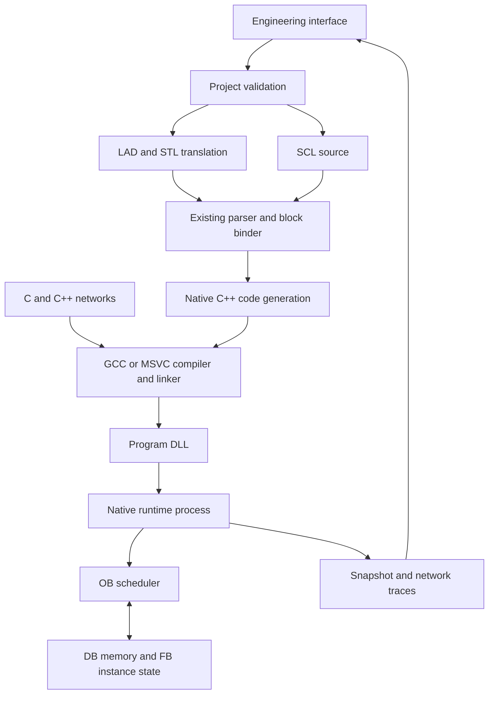

# Windows PLC Studio

This adds an executable, Windows-first engineering workflow to the original
C++20 runtime. The programming model uses organization blocks (OBs), numbered
global data blocks, instance DBs, FBs, FCs, and ordered networks. It is a custom
PLC implementation inspired by those concepts, **not a Siemens emulator**:
TIA Portal projects, Siemens binary blocks and the complete Siemens language
instruction sets are not compatible.

## Start on Windows

Use **64-bit Windows 10/11** and the **Windows Portable** download.
The package includes application-local Python and an open-source GCC/MinGW-w64
compiler. It requires no Visual Studio, Python installation, administrator
access, Qt, Electron, Node.js runtime, or internet connection during use.

1. Download the `SOFT-PLC-Studio-Windows-Portable` GitHub Actions artifact.
   Extract the downloaded ZIP, then its contained Studio ZIP. Keep the entire
   `SOFT-PLC` folder together in a writable location; do not run inside the ZIP.
2. Double-click **Start-Studio.cmd**. Keep its console window open.
3. Your browser opens the local engineering interface with the motor demo.
4. Select **Compile → Load to CPU → RUN**. The first compile unpacks the bundled
   compiler and builds the tools; subsequent builds reuse them.
5. Open **Online watch**. Write `TRUE` to `DB1.Start`, then observe
   `DB1.Run`, `Motor1.Ready`, `MotorOutput`, counters and network status.
6. Write `TRUE` to `DB1.Stop` to release the latch, or press **STOP**.

The native CPU is a separate C++ process. The compiler runs only during builds;
it is not part of the scan loop. Most of the portable download consists of the
compressed compiler payload, which expands on first use. The UI is plain
HTML/CSS/JavaScript served by Python's standard library. Component licenses and
corresponding source downloads are listed in `THIRD-PARTY-NOTICES.md`.

### Working from a source checkout

Developers can install Python 3.10+ and extract x64
[w64devkit](https://github.com/skeeto/w64devkit/releases/tag/v2.10.0) anywhere.
Set `SOFTPLC_TOOLCHAIN` to its root folder (containing `bin/g++.exe`), or put its
`bin` folder on PATH. `SOFTPLC_COMPILER=mingw` explicitly disables MSVC fallback.
The bundled compiler takes precedence over PATH when no override is set.

The existing MSVC backend is optional: `SOFTPLC_COMPILER=msvc` selects it, using
an existing Visual Studio Build Tools installation. Compiler tools are cached
in separate folders, avoiding reuse across MSVC and MinGW.

To assemble the self-contained portable ZIP on Windows:

```powershell
python tools/portable.py --prepare
$env:SOFTPLC_COMPILER = "mingw"
python -m unittest discover -s tests/studio -v
python tools/package_studio.py --portable
```

Only `--prepare` downloads dependencies. It verifies pinned SHA-256 hashes from
the upstream releases. Normal Studio startup and compilation use local files.
The embedded Python path is isolated from installed Python packages.

The default editable project is saved in `build/studio/workspace/project.json`.
**Export** downloads a portable JSON copy. **Project settings** allows editing
or pasting a complete project definition; press **Apply JSON**, then **Save**.
Add OBs, FBs/FCs, DB fields and FB instances with the interface buttons.

A successful build does not change a running CPU. Loading requires STOP.
Edited code must be compiled again before loading. Network highlighting is
suppressed when the editor does not match the loaded build. Each loaded module
has a build identifier shown in Online watch.

## Architecture



| Layer | Implementation |
|---|---|
| Project / front ends | `tools/plc_project.py`: JSON validation, LAD and STL translation, DB layout |
| Code generator | `apps/plc_codegen/main.cpp`: existing ST AST to native C++ with static type checks |
| Native contract | `include/softplc/runtime/program_abi.h`: versioned C ABI used by C, C++ and generated blocks |
| Runtime | `apps/plc_runtime/main.cpp`: DLL loading, memory images, scheduler, STOP/RUN/FAULT, snapshots |
| Engineering service | `tools/plc_studio.py`: localhost HTTP, compiler jobs and a private child runtime process |
| User interface | `tools/studio/`: project tree, network editing, graphical ladder, DB editor, live watch |
| Build orchestration | `tools/plc_build.py`: portable GCC / optional MSVC detection, tool builds and unique module builds |

The compiler resolves symbolic tags once and generates direct operations on
numeric tag IDs. User code is compiled into the DLL; the runtime does **not**
re-parse ST or walk its AST during each scan. The original interpreted
`plc_runner` remains available separately.

## OB execution

- **OB1 / main**: runs cyclically at the configured target scan interval.
  This version uses an explicit main period, default 10 ms, rather than a
  continuously free-running hardware PLC cycle.
- **Startup OB**, e.g. **OB100**: once per STOP → RUN transition, before cyclic
  execution. Memory is retained across STOP/RUN in the same loaded program.
- **Cyclic OB**, e.g. **OB35**: released periodically, e.g. every 100 ms.
  Higher numeric priorities run first.
- A higher-priority cyclic OB can interrupt lower-priority generated logic at
  **network boundaries, block entry and WHILE checkpoints**. Execution is
  cooperative on one worker thread, keeping memory access serialized. This
  is not instruction-level hardware interrupt preemption.
- `System.CycleTime` is the executing OB's elapsed interval in milliseconds;
  native code also receives `ctx->elapsed_us`. The previous value is restored
  when a preempted OB resumes.
- Delayed releases are counted and coalesced; no unbounded catch-up queue.
- Each OB reports cycles, duration, maximum duration, missed releases,
  overruns and maximum release jitter.
- A watchdog is checked at cooperative checkpoints and at task completion.
  Runtime arithmetic errors, invalid accesses and watchdog failures enter
  **FAULT** and zero the output image. RESET is required before RUN again.
- STOP cancels generated loops at checkpoints and zeroes outputs. **Single
  scan** executes OB1 while stopped, without startup or cyclic OBs, then
  returns outputs to zero.

Normal Windows scheduling is **soft real-time**. The 1 ms scheduler polling
interval and OS scheduling delays mean configured periods are targets, not
hardware timing guarantees. Native C/C++ code must return promptly or call
`ctx->api->checkpoint(ctx)` in longer loops. An unresponsive native block
cannot be safely preempted inside the process; the Studio supervisor stops an
unresponsive runtime process after its command timeout. This release does
not connect that runtime to physical I/O.

## DBs, FBs and FCs

Global fields use symbolic names such as `DB1.Speed` and declared absolute
aliases such as `DB1.DBD8` or `DB1.DBX0.2`. Both forms resolve to the same
storage in generated SCL/STL. An absolute source operand must correspond to
a declared field; arbitrary indirect DB addressing is not implemented.

The host also exposes bounded raw DB read/write callbacks to native code.
DB memory stores multi-byte numbers in **big-endian** byte order; raw and
symbolic accesses share the same bytes. BOOL fields can share different bits
of one byte. Overlapping declarations are rejected.

| Type | Storage | Address example |
|---|---|---|
| BOOL | 1 selected bit | `DB1.DBX0.0` |
| BYTE | 1 byte, unsigned | `DB1.DBB1` |
| INT | 2 bytes, signed | `DB1.DBW2` |
| DINT / REAL | 4 bytes | `DB1.DBD4` |
| LREAL / TIME | 8 bytes | `DB1.DBL8` (project extension) |
| STRING | 256 bytes, NUL-terminated UTF-8, max 254 content bytes | first-byte `DBB` address |

TIME is a signed 64-bit millisecond value here, not Siemens' 32-bit TIME wire
format. STRING storage is also this project's format, not an S7 STRING header.
This runtime is not a Siemens memory-protocol endpoint.

Declare an FB instance in `instances`, e.g. `Motor1 : FB_Motor` with DB101.
Its inputs, outputs and persistent VAR members receive distinct DB101 storage;
a second instance can use DB102. Instance offsets are allocated in declaration
order and shown after compilation in the watch table. Nested instance members
share the enclosing instance DB. `VAR_TEMP` stays scratch storage and resets
per call. Use distinct FB instances for independent tasks; deliberately sharing
one instance between preempting OBs also shares its mutable state.

FCs have no persistent VAR section. Their VAR_TEMP **and VAR_OUTPUT** values
reset per call. Inputs must be explicitly connected. FB/FC calls use named
bindings: `Input := expression`, `Output => target`. Standard `TON`, `TOF`,
`CTU`, `CTD` remain available through the existing ST library.

DB values currently survive STOP/RUN only. LOAD and RESET initialize memory;
there is no disk retention or `VAR RETAIN` support yet.

## Language support in this version

| Language | Implemented | Not implemented |
|---|---|---|
| LAD | Graphical series contacts, parallel branches, NO/NC contacts, direct/SET/RESET coils, enabled named FB/FC calls | Full TIA ladder grid, arbitrary nested branches, Siemens ENO rules |
| SCL | Existing typed ST subset: assignments, expressions, IF/ELSIF/ELSE, WHILE, DB references, FB/FC calls | FOR, CASE, arrays/STRUCT, VAR_IN_OUT, expression-returning FC calls, complete Siemens SCL syntax |
| STL | `A AN O ON X XN NOT SET CLR = S R L T`, integer/real arithmetic and comparisons, named `CALL` | Jumps, status-word emulation, indirect addressing, complete AWL/S7 instruction set |
| C | C17 native network function bodies using `PlcContext` and the host API | Automatic translation of arbitrary external library ABIs |
| C++ | C++20 native network function bodies, same ABI and shared PLC memory | Automatic hot patching of an executing native block |

STL here means a **Siemens-style Statement List subset**, not IEC Structured
Text. SCL is the high-level structured language. Unsupported STL instructions
produce a compile error. Numeric STL loads capture their values at the L
instruction; arithmetic/transfer operates on those snapshots. `+I/-I/*I//I`
use checked DINT results in this subset, not a full Siemens 16-bit accumulator
and status-word model. Keyword matching is case-insensitive; identifiers in
the inherited parser remain case-sensitive.

A project stores ordered networks within OBs and FB/FC definitions. Networks
can mix supported languages. LAD calls execute when the rung is powered;
SCL/STL calls execute according to their surrounding logic. Live LAD shows
the last sampled rung power, not an instruction-level trace of every contact.
When a block has multiple runtime scopes, select the instance in its network
header. FC scopes include the generated call-site identifier.

### Native C example

```c
PlcValue value;
PLC_TRY(plc_read(ctx, "DB1.Counter", &value));
if (value.integer >= 2147483647) return -1;
PLC_TRY(plc_write_dint(ctx, "DB1.Counter", (int32_t)(value.integer + 1)));
```

Only the function body is entered in a C/C++ network; the compiler adds the
header and function signature. `ctx->scope` identifies the current block
instance, and relative tag names first resolve inside that instance. Return
zero on success. Do not write to stdout: it is the runtime's command channel.
Native source is trusted local code, with normal process privileges; this is
not an untrusted-code execution sandbox.

## Online monitoring

After LOAD, Studio automatically polls snapshots every 500 ms. It displays
symbolic names, absolute addresses, types, values, per-OB timing and per-network
execution counts and power. **Write** changes a value once under the runtime
lock between outer task executions; PLC logic can overwrite it later. It is
not persistent forcing. System timing tags are read-only. STRING values can
be monitored but are not writable through the watch table in this version.

The engineering service binds only to `127.0.0.1`. API access requires a
random per-session token and accepts only the local Host/Origin. The native
runtime is a private child process with line-framed commands on its pipes;
it opens no network listener. Remote PLC download, remote HMI authentication,
OPC UA and S7 protocol access are separate future work.

## Build and verify without Studio

```powershell
python tools/plc_build.py --tools-only
python tools/plc_build.py examples/windows_demo/project.json
python -m unittest discover -s tests/studio -v
```

Build output goes under `build/studio/programs/<build-id>-<unique-suffix>/`:
`program.dll`, `manifest.json`, the input project, normalized ST, generated
C++, and symbols. Unique paths avoid overwriting a loaded Windows DLL.
The exported `softplc_program_v1` descriptor is versioned and checked before
replacement. Failed compilation or failed loading preserves the previous
loaded program. A load resets memory; online code-change migration is not
implemented.

The `.github/workflows/studio.yml` workflow tests GCC/MinGW and optional MSVC
on Windows 2022, plus GCC on Ubuntu. The existing core tests run without
Modbus dependencies. A separate Windows job extracts the final Portable ZIP
to a path with spaces and runs its launcher in Edge with only Windows system
directories on PATH, using bundled Python/GCC and disabling MSVC fallback.
Successful runs publish the offline ZIP and browser screenshots as artifacts.
The tests compile actual modules and exercise OB scheduling, all five language
paths, instance isolation, FC reset behavior, DB aliases, native raw DB memory,
online writes, watchdogs, faults, transactional loading and HTTP access checks.

The original CMake path is also available:

```powershell
cmake -S . -B build/cmake -DSOFTPLC_ENABLE_MODBUS=OFF
cmake --build build/cmake --config Debug
ctest --test-dir build/cmake -C Debug --output-on-failure
```

Keep `SOFTPLC_ENABLE_MODBUS=ON` for the original fieldbus drivers. The new
native runtime currently uses its in-memory I/Q/M images; those drivers still
need an adapter and engineering configuration to connect to it. Existing
POSIX socket/PTY integration tests are gated off on Windows.

The Linux module loader and build path are present for portability testing
(`python3 tools/plc_studio.py`, GCC; `.so` instead of `.dll`). Windows remains
the first user-facing target; Linux real-time deployment and physical I/O
integration are later phases.

## Reference model

The organization-block terminology follows Siemens' public documentation:
[OB1 cyclic program](https://docs.tia.siemens.cloud/r/en-us/v21/organization-blocks-s7-300-s7-400/cyclic-program-ob-1-s7-300-s7-400)
and [cyclic interrupt OBs](https://docs.tia.siemens.cloud/r/en-us/v21/organization-blocks-s7-300-s7-400/cyclic-interrupt-organization-blocks-ob-30-to-ob-38-s7-300-s7-400).
Windows module loading uses the [Microsoft runtime linking APIs](https://learn.microsoft.com/en-us/windows/win32/dlls/run-time-dynamic-linking).
